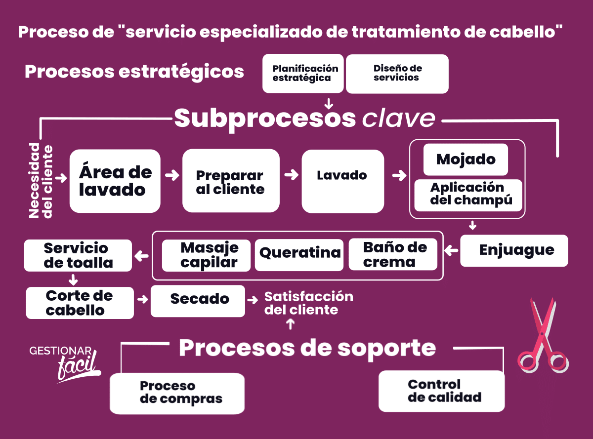
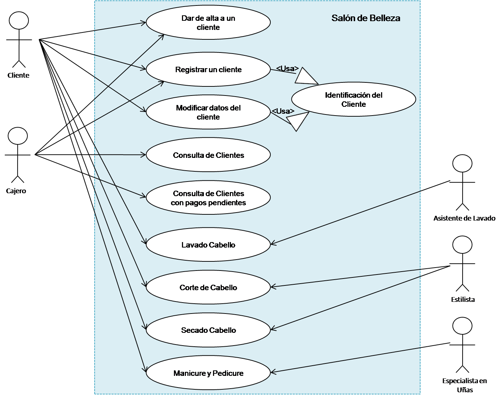
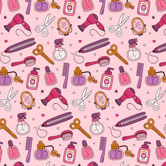

# LOOK_STILISTA

## Problema😬
El problema que busca resolver LookStyle es la dificultad para encontrar estilos de peinado y color de cabello que se adapten a las preferencias y características individuales de cada cliente.

## Solución😎
LookStyle es una app que utiliza inteligencia artificial para ofrecer recomendaciones personalizadas de estilos de peinado y color de cabello, permitiendo a los clientes explorar y encontrar looks que se adapten a su gusto y necesidades.

## Actores👨🏿‍🤝‍👨🏼💁‍♂️💁‍♂️💁

- Clientes: usuarios que buscan inspiración y recomendaciones para su look.
- Peluqueros: profesionales que utilizan la app para ofrecer servicios personalizados a sus clientes.
  

## Historias de Usuario

### PASO A PASO  DE HISTORIA DE USUARIO

- Como cliente, quiero encontrar estilos de peinado y color de cabello que se adapten a mi rostro y preferencias.
- Como peluquero, quiero utilizar la app para ofrecer recomendaciones personalizadas a mis clientes y mejorar mi servicio.

 **Registro de Cliente** quiero registrar a un nuevo cliente con su información personal y preferencias de estilo, para poder ofrecerle un servicio personalizado y guardar su información para futuras citas.*

 **Agenda de Citas**

Como estilista, quiero agendar una cita con un cliente para un servicio de estilismo, para poder organizar mi tiempo y asegurarme de que el cliente reciba el servicio en el momento adecuado.

**Selección de Estilo**

Como estilista, quiero seleccionar un estilo para un cliente basado en sus preferencias y características, para poder ofrecerle un look que se adapte a sus necesidades y gustos.

 **Aplicación de Estilo**

Como estilista, quiero aplicar el estilo seleccionado al cliente, para poder ver el resultado final y asegurarme de que el cliente esté satisfecho con el servicio.

 **Pago y Facturación**

Como estilista, quiero procesar el pago del cliente por el servicio de estilismo, para poder recibir el pago correspondiente y emitir una factura por el servicio prestado.

**Seguimiento y Evaluación**

Como estilista, quiero seguir el progreso del cliente y evaluar la efectividad del estilo aplicado, para poder hacer ajustes y mejoras en el servicio y asegurarme de que el cliente esté satisfecho con el resultado final.

## Mapa de Navegación

- Pantalla de inicio: búsqueda de estilos por tipo de cabello, rostro y preferencias.
- Galería de estilos: visualización de looks recomendados con fotos y descripciones.
- Perfil de cliente: registro de preferencias y historial de estilos favoritos.

## Diagrama de Casos de Uso

- Cliente busca y explora estilos recomendados.
- Peluquero utiliza la app para ofrecer recomendaciones a su cliente.
- Cliente guarda y comparte sus estilos favoritos.

## Patrón de Arquitectura

- Arquitectura en capas: presentación, lógica de negocio, acceso a datos.
- Patrón de diseño: Modelo-Vista-Controlador (MVC) con una base de datos relacional y un motor de recomendaciones basado en inteligencia artificial.

